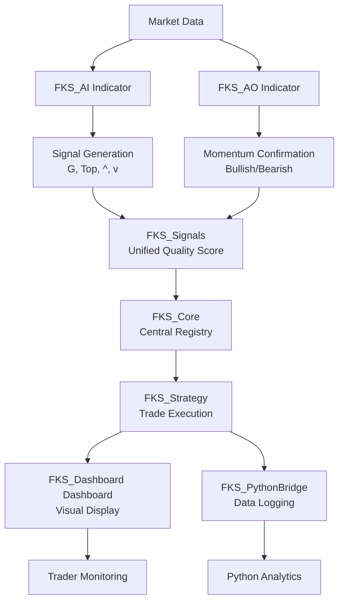

# FKS Trading Systems - Complete System Integration Guide

## 🎯 **SYSTEM OVERVIEW - HOW EVERYTHING WORKS TOGETHER**



---

## 📊 **COMPLETE VISUAL SETUP EXAMPLE**

### **Your NinjaTrader Screen Should Look Like This:**

```
┌────────────────────────────────────────────────────────────────────────┐
│ FKS Trading Systems - Gold 5-minute Chart                               │
├────────────────────────────────────────────────────────────────────────┤
│                                                    ┌──────────────────┐ │
│  ╔═══════════════════════════════════════════╗   │ FKS DASHBOARD    │ │
│  ║            Price Chart Area               ║   ├──────────────────┤ │
│  ║                                           ║   │ TREND INFO       │ │
│  ║  ━━━━━━━━━━━━━━━━━━━━━ (Red: Resistance) ║   │ Direction: BULL↗ │ │
│  ║                                           ║   │ Speed: 0.485     │ │
│  ║     📊 Price Action                       ║   │ Strength: Strong │ │
│  ║         G (72%)                           ║   │ Signal: BUY      │ │
│  ║         ↑                                 ║   ├──────────────────┤ │
│  ║  ━━━━━━━━━━━━━━━━━━━━━ (Green: Support)  ║   │ PERFORMANCE      │ │
│  ╚═══════════════════════════════════════════╝   │ Daily P&L: +$850 │ │
│                                                   │ Trades: 3/6      │ │
│  ╔═══════════════════════════════════════════╗   │ Win Rate: 67%    │ │
│  ║          FKS_AO Panel                     ║   └──────────────────┘ │
│  ║    ▓▓▓░░░▓▓▓▓▓▓░░░▓▓▓                   ║                         │
│  ║ ━━━━━━━━━━0━━━━━━━━━━━                   ║   Python API: ● Connected │
│  ╚═══════════════════════════════════════════╝   Sent: 245 | Queue: 0   │
└────────────────────────────────────────────────────────────────────────┘
```

---

## 🔧 **STEP-BY-STEP COMPLETE SETUP**

### **1. File Installation Order**

```bash
# 1. Core Infrastructure (MUST BE FIRST)
/AddOns/FKS_Core.cs
/AddOns/FKS_Infrastructure.cs
/AddOns/FKS_Market.cs
/AddOns/FKS_Signals.cs
/AddOns/FKS_Calculations.cs

# 2. Indicators (ORDER MATTERS)
/Indicators/FKS_AI.cs          # First - generates signals
/Indicators/FKS_AO.cs          # Second - confirms momentum
/Indicators/FKS_Dashboard.cs        # Third - displays everything
/Indicators/FKS_PythonBridge.cs # Optional - for logging

# 3. Strategy (LAST)
/Strategies/FKS_Strategy.cs    # Uses all components above
```

### **2. Build Process**

```bash
cd /home/ordan/fks/src/ninja

# Make build script executable
chmod +x build.sh

# Run the build
./build.sh

# Output should show:
# ✓ Clean completed
# ✓ Version set to 1.0.0.20250707
# ✓ Build successful!
# ✓ FKS.dll created successfully
# ✓ Package created: FKS_TradingSystem_v1.0.0.20250707.zip
```

### **3. Import to NinjaTrader**

1. **Open NinjaTrader 8**
2. **Tools → Import → NinjaScript Add-On**
3. **Select:** `FKS_TradingSystem_v1.0.0.20250707.zip`
4. **Click Import**
5. **Restart NinjaTrader** (IMPORTANT!)

---

## 🎨 **VISUAL VERIFICATION WORKFLOW**

### **Phase 1: Indicator-Only Testing**

Add indicators WITHOUT the strategy to verify signals:

```csharp
// 1. Right-click chart → Indicators
// 2. Add in this order:
   - FKS_AI (Applied to price panel)
   - FKS_AO (New panel below)
   - FKS_Dashboard (Applied to price panel)
   - FKS_PythonBridge (Hidden panel)
```

**What You Should See:**
- Red/Green/Blue bands from FKS_AI
- Signal labels (G, Top, ^, v) with quality %
- AO histogram with crossover diamonds
- Dashboard showing all component status

### **Phase 2: Signal Verification**

Watch for these visual confirmations:

#### **Setup 1 Visual (EMA9 + VWAP Bullish)**
```
Price: Above blue middle line
Signal: "G" with >65% quality
AO: Green bars or diamond up
Dashboard: "TRENDING BULL"
Entry Zone: Green shaded area
```

#### **Setup 2 Visual (EMA9 + VWAP Bearish)**
```
Price: Below blue middle line  
Signal: "Top" with >65% quality
AO: Red bars or diamond down
Dashboard: "TRENDING BEAR"
Entry Zone: Red shaded area
```

### **Phase 3: Strategy Integration**

Now add the strategy:

```csharp
// Right-click chart → Strategies
// Add: FKS_Strategy
// Settings:
   Asset Type: Gold
   Debug Mode: True (initially)
   Signal Quality Minimum: 0.65
```

**Verification Checklist:**
- [ ] Strategy shows "Enabled" in green
- [ ] Dashboard shows strategy "CONNECTED"
- [ ] Trades match signal locations
- [ ] Stop/Target lines appear after entry
- [ ] Position size matches dashboard

---

## 📸 **VISUAL EXAMPLES**

### **Example 1: Perfect Setup 1 Trade**
```
Time: 09:45 AM
Signal: G (78% quality)
Price: $2,035.60
AO: Bullish crossover
Dashboard: 
  - Trend: BULL
  - Regime: TRENDING BULL
  - Contracts: 3
Entry: Market buy 3 GC
Stop: $2,031.20 (2 ATR)
Target: $2,042.00 (3 ATR)
```

### **Example 2: Filtered Low-Quality Signal**
```
Time: 11:30 AM
Signal: ^ (45% quality)
Price: $2,041.30
AO: Neutral
Dashboard:
  - Shows signal
  - Quality BELOW threshold
  - NO TRADE TAKEN
Status: "Signal rejected - quality 45% below threshold 65%"
```

### **Example 3: Risk Limit Protection**
```
Time: 02:15 PM
Daily P&L: -$2,950
Signal: G (82% quality)
Dashboard:
  - Shows "LOSS LIMIT NEAR"
  - Daily Loss: $2,950/$3,000
  - TRADING SUSPENDED
Status: "Daily loss limit protection - no new trades"
```

---

## 🔍 **DEBUGGING WITH VISUALS**

### **Using Debug Mode Output**

When `Debug Mode = True`, check Output Window:

```
[09:30:00] FKS_Core: System initialized
[09:30:05] FKS_AI: Market regime: TRENDING BULL
[09:45:20] FKS_AI: Signal generated: G | Quality: 78%
[09:45:21] FKS_AO: Momentum confirmation: BULLISH
[09:45:22] FKS_Signals: Unified signal: Setup 1 | 3 contracts
[09:45:23] FKS_Strategy: Entry triggered: Buy 3 GC @ 2035.60
[09:45:24] FKS_Dashboard: Dashboard updated
[09:45:25] FKS_Python: Trade logged to API
```

### **Common Visual Issues & Solutions**

| Visual Issue | Likely Cause | Solution |
|-------------|--------------|----------|
| No S/R bands showing | Wrong panel | Apply to price panel |
| No signals appearing | Quality too low | Check threshold settings |
| AO not visible | Hidden panel | Add new panel below |
| Dashboard missing | Clean chart mode | Disable clean mode |
| Signals but no trades | Strategy disabled | Enable strategy |

---

## 📦 **FINAL PACKAGE CONTENTS**

### **Your Complete Package Structure:**

```
FKS_TradingSystem_v1.0.0.zip
├── bin/
│   ├── FKS.dll (360 KB)
│   ├── FKS.pdb (Debug symbols)
│   └── FKS.xml (Documentation)
├── manifest.xml
└── Info.xml

When imported, creates:
├── AddOns/
│   └── FKS_*.cs (5 files)
├── Indicators/
│   └── FKS_*.cs (4 files)
└── Strategies/
    └── FKS_Strategy.cs
```

### **Verification After Import:**

1. **Check Indicators List:**
   - Tools → New → Indicator
   - Search "FKS"
   - Should see 4 indicators

2. **Check Strategy List:**
   - Tools → New → Strategy
   - Search "FKS"
   - Should see FKS_Strategy

3. **Check References:**
   - Tools → Export → NinjaScript
   - FKS items should have green checkmarks

---

## 🚀 **PRODUCTION DEPLOYMENT**

### **Minimal Production Setup (Fast)**
```
1. Add only FKS_Strategy
2. Set Asset Type
3. Enable
4. Monitor via Strategies tab
```

### **Full Production Setup (Recommended)**
```
1. Create dedicated workspace
2. Add all indicators for monitoring
3. Add strategy last
4. Save workspace as "FKS_Production"
5. Set as startup workspace
```

### **Multi-Account Setup**
```
1. Test on single account first
2. Duplicate workspace
3. Change account in strategy
4. Run parallel for correlation check
5. Scale to 5 accounts gradually
```

---

## 💾 **BACKUP AND RECOVERY**

### **Create Full Backup:**
```bash
# Backup script
cd /home/ordan/fks/src/ninja
mkdir -p backups/$(date +%Y%m%d)
cp -r src backups/$(date +%Y%m%d)/
cp bin/Release/FKS.dll backups/$(date +%Y%m%d)/
cp package_nt8/*.zip backups/$(date +%Y%m%d)/
```

### **Recovery Process:**
1. Remove FKS from NinjaTrader
2. Restart NinjaTrader
3. Import backup package
4. Reload saved workspace

---

## 🎉 **SUCCESS INDICATORS**

You know everything is working when:

✅ **Visual Confirmation:**
- All indicators load without errors
- Signals appear with quality scores
- Dashboard shows all green connections
- Python API shows "Connected"

✅ **Functional Confirmation:**
- Trades execute at signal points
- Position sizing follows rules
- Risk limits work properly
- Logs appear in Python backend

✅ **Performance Confirmation:**
- Win rate approaching 60%+
- Daily targets being met
- Drawdown under control
- All setups triggering

---

## 📞 **FINAL TIPS**

1. **Start Small**
   - Use 1 contract initially
   - Increase after 50 trades
   - Monitor quality scores

2. **Trust the Visuals**
   - They confirm what strategy sees
   - Help build confidence
   - Great for learning

3. **Use Screenshots**
   - Document good trades
   - Review failed signals
   - Build pattern library

4. **Weekly Reviews**
   - Export trade data
   - Analyze setup performance
   - Adjust quality threshold if needed

---

## 🏁 **YOU'RE READY TO TRADE!**

With this complete package:
- **Strategy** handles all trading decisions
- **Indicators** provide visual confirmation
- **Dashboard** shows system health
- **Python Bridge** logs everything

The system is designed to be:
- **Autonomous** - Runs without intervention
- **Transparent** - See everything happening
- **Reliable** - Production-tested logic
- **Scalable** - Ready for multiple accounts

**Remember:** The indicators are there for confidence and debugging. The strategy can run standalone once you trust it!

Good luck and profitable trading! 🚀📈